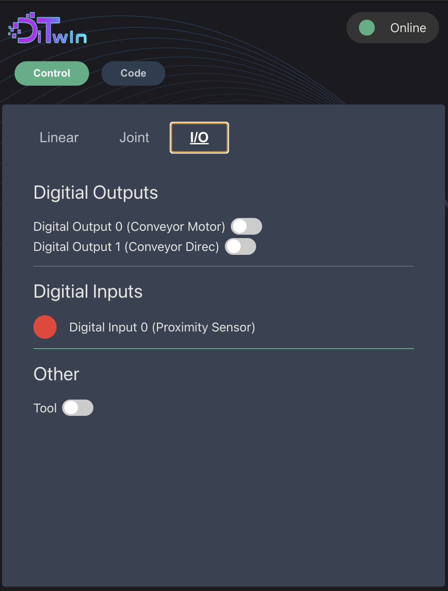

# Dtwin Use Guide

The Digital twin of the robotics system consists on two distinct programs: The main digital twin program and the user interface. 

The main digital twin program, from now on referred to as the "Digital Twin", is the program that runs all the simulations, 3d visualizations, and controls the communication with the robotic system and the clients.

The user interface is a program that comunicates with the Digital Twin, acting as a client, and allows the user to control the robotic system. This program allows direct control of the robot (moving the robot, opening and closing the gripper, etc.), but also allows the user to use programming (javascript) to control it. It uses the Dtwin API, and if you want to know more about it, you can read the [Dtwin API documentation](Programming_Guide.md).

Is possible to run the Digital Twin without the user interface, using the Websocket interface to control the system directly, but this is only recomended for advanced users.

## How to run the Digital Twin

There are two ways to run the Digital Twin, the first one is "offline" in what is call "simulation mode". Here, you can test all your code and the user interface in your own computer, without the need to connect to the robot. If you want to user the real robot, you need to reserve a place using the form in the website, and then, using Anydesk, you will connect to the computer that is running a version of the Digital Twin that is connected to the robot.

## Download the programs for "Offline" mode

To run the Digital Twin, you only need to download it [here]() execute it (no need to install anything). The same for the user interface, that you can download [here]().

Once you have the programs running, you will be able to control the system using the user interface. Remember that the user interface is a client, so you need to run it on the same computer as the Digital Twin, and it will not work at all if the Digital Twin is not running.

In this mode you can do anything that you will do in the real robot. Is recomended to test your code here before trying to connect to the real system.

## Using the real robot

The only software that you need to install is Anydesk, that you can download [here](https://anydesk.com/download/). Then, follow the procedure indicated in the website to connect to the robot. There will be a tecnhician on call with you while you are using it, so you can ask questions if you need.

# The user interface

The user interface is what you will use to control the system. Here we will explain how to use it.

When you open the main user interface, you will see the screen shown in the Figure 1.

<figure>
  
  <figcaption>Figure1. User interface main screen</figcaption>
</figure>

Here you can see the two main tabs:"Control" and "Code". 
In the "Control" tab, you can control all the robotic system, like moving the robot, opening and closing the gripper, etc. The different control modes are separated by tabs: Linear, Joint and I/O

#### Linear and Joint Control

Thiw two control modes are very similar, so we will talk about then at the same time. They allow you to move the robot in cartesian or joint space.You can select with the sliders the desired position of the robot, and then press the "Send" button to send the command to the Digital Twin. Using the stop button, you can stop the movement at any time.

There is also a Go home button that allows you to move the robot to the home position.

#### I/O Control

This control mode allows you to control the digital ports of the robot, as well as the gripper, as you can see in the Figure 2.

<figure>
  
  <figcaption>Figure 2. I/O control mode</figcaption>
</figure>

You can move the digital outputs and see the state of the digital inputs. You can also set the grip state of the gripper (open or closed).

## Programming

The user interface also allows you to program the robot using javascript. You can write your code in the "Code" tab, and then press the "Run" button to run it. As is the nature of user run code, the program that you write may have some error or stay on some kind of loop. You can abort the execution of the code by pressing the "Stop" button.

Using the Save and Load buttons, you can save your code and load it later. There is also a console output, where you can see some useful logs, as well as any user made loggin that you write in the code. For more information about the Dtwin API, you can read the [Dtwin API documentation](Programming_Guide.md).
<figure>
  
  <figcaption>Figure 3. Code screen</figcaption>
</figure>
